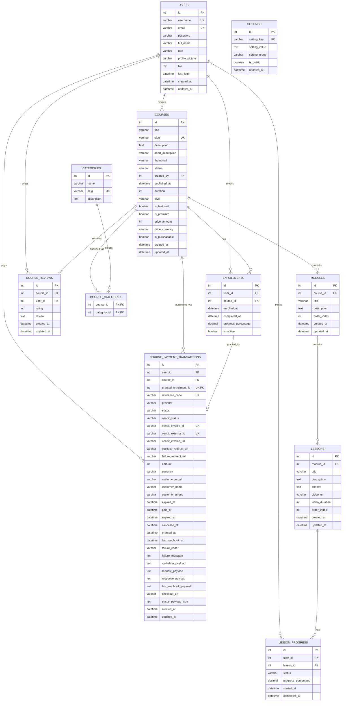

# Database ERD Design

Dokumen ini merangkum desain ERD berdasarkan **source of truth utama di root project ini**, terutama:

- `app/Database/Migrations/*.php`
- `app/Models/*.php`
- `app/Controllers/*` yang memakai relasi pembayaran/review/enrollment

> Catatan penting: ada dokumen lama seperti `PROJECT_ERD.md` dan `.cursor/rules/schema-db-rules.md`, tetapi schema aktual saat ini sudah berkembang. Versi aktual menambahkan **premium course**, **payment transaction**, **course reviews**, dan **role `super_admin`**. Sebaliknya, `lesson_resources` dan `categories.parent_id` tertulis di dokumen lama namun **tidak ditemukan di migration aktif**.

## 1. Mermaid ERD

## 2. Struktur Tabel

### `users`
- PK: `id`
- Unique: `username`, `email`
- Dipakai untuk autentikasi, dashboard, admin RBAC, review, enrollment, payment
- Nilai role yang terlihat dari codebase saat ini: `user`, `admin`, `super_admin`

### `categories`
- PK: `id`
- Unique: `slug`
- Master data kategori kursus

### `courses`
- PK: `id`
- FK: `created_by -> users.id`
- Unique: `slug`
- Menyimpan metadata kursus, publish state, level, featured flag, dan monetization premium

### `course_categories`
- Composite PK: (`course_id`, `category_id`)
- FK: `course_id -> courses.id`
- FK: `category_id -> categories.id`
- Junction table many-to-many antara kursus dan kategori

### `modules`
- PK: `id`
- FK: `course_id -> courses.id`
- Index komposit: (`course_id`, `order_index`)
- Menjaga urutan modul di dalam course

### `lessons`
- PK: `id`
- FK: `module_id -> modules.id`
- Index komposit: (`module_id`, `order_index`)
- Menyimpan unit materi belajar per modul

### `enrollments`
- PK: `id`
- FK: `user_id -> users.id`
- FK: `course_id -> courses.id`
- Unique: (`user_id`, `course_id`)
- Menjadi sumber akses user terhadap course

### `lesson_progress`
- PK: `id`
- FK: `user_id -> users.id`
- FK: `lesson_id -> lessons.id`
- Unique: (`user_id`, `lesson_id`)
- Menyimpan status progres user per lesson

### `course_reviews`
- PK: `id`
- FK: `course_id -> courses.id`
- FK: `user_id -> users.id`
- Menyimpan rating dan review text user untuk course
- Saat ini migration memberi index pada (`course_id`, `user_id`), bukan unique constraint

### `settings`
- PK: `id`
- Unique: `setting_key`
- Key-value configuration table untuk pengaturan aplikasi

### `course_payment_transactions`
- PK: `id`
- FK: `user_id -> users.id`
- FK: `course_id -> courses.id`
- FK: `granted_enrollment_id -> enrollments.id`
- Unique: `reference_code`, `xendit_invoice_id`, `xendit_external_id`, `granted_enrollment_id`
- Menyimpan seluruh lifecycle pembayaran premium course
- Ada partial unique index tambahan untuk memastikan **maksimal satu transaksi pending aktif** per `user_id + course_id`

## 3. Normalisasi

### 1NF
Schema sudah berada di 1NF karena:
- tiap kolom menyimpan nilai atomik
- relasi many-to-many dipisah ke `course_categories`
- progres user per lesson dipisah ke `lesson_progress`
- transaksi pembayaran dipisah dari `enrollments`

### 2NF
Schema sudah mendekati 2NF penuh karena:
- tabel utama memakai surrogate key `id`
- tabel junction `course_categories` memakai composite PK yang seluruh atributnya bergantung pada kombinasi key
- `enrollments` dan `lesson_progress` memakai surrogate PK, tapi tetap menegakkan keunikan bisnis lewat unique constraint komposit

### 3NF
Sebagian besar schema sudah 3NF karena:
- data user, course, category, review, enrollment, dan progress dipisah per entitas bisnis
- atribut non-key umumnya bergantung pada key tabelnya sendiri
- data monetization course dipisah dari transaksi aktual pembayaran

### Catatan desain / trade-off
Ada beberapa bagian yang **sengaja semi-denormalized** karena kebutuhan aplikasi:
- `course_payment_transactions` menyimpan payload mentah (`request_payload`, `response_payload`, `last_webhook_payload`, `status_payload_json`) untuk audit/debugging webhook
- `users.role` masih berupa string langsung di tabel `users`; ini sederhana dan cocok untuk RBAC kecil, tetapi bila role/permission makin kompleks bisa dipisah ke tabel `roles` dan `user_roles`
- `settings` memakai pola key-value; fleksibel, tetapi kurang ketat dibanding tabel konfigurasi terstruktur

## 4. Temuan Penting dari Root Project

### Schema aktual yang benar-benar ada di migration
- `users`
- `categories`
- `courses`
- `course_categories`
- `modules`
- `lessons`
- `enrollments`
- `lesson_progress`
- `settings`
- `course_reviews`
- `course_payment_transactions`

### Perbedaan dengan dokumen lama
- `lesson_resources` dijelaskan di `PROJECT_ERD.md`, tetapi **tidak ada migration aktifnya**
- `categories.parent_id` juga tertulis di dokumen lama, tetapi **tidak ada di migration aktif**
- `users.role` pada migration awal bertipe `VARCHAR(20)`, bukan enum; implementasi aplikasi saat ini sudah memakai `super_admin`
- `courses.price_amount` dan `course_payment_transactions.amount` awalnya decimal lalu dimigrasikan menjadi **integer** agar lebih aman untuk nominal rupiah di PostgreSQL

## 5. Rekomendasi Desain

Jika ERD ini mau dijadikan acuan final untuk laporan atau implementasi berikutnya, saran saya:

1. Jadikan **migration files** sebagai source of truth utama, bukan `PROJECT_ERD.md` lama.
2. Jika `lesson_resources` memang masih dibutuhkan, buat migration baru agar tabel itu benar-benar ada.
3. Jika kategori bertingkat masih dibutuhkan, tambahkan migration baru untuk `categories.parent_id`.
4. Pertimbangkan unique constraint pada `course_reviews (course_id, user_id)` bila satu user memang hanya boleh memberi satu review per course.
5. Bila RBAC berkembang, normalisasi `users.role` ke tabel role/permission terpisah.
