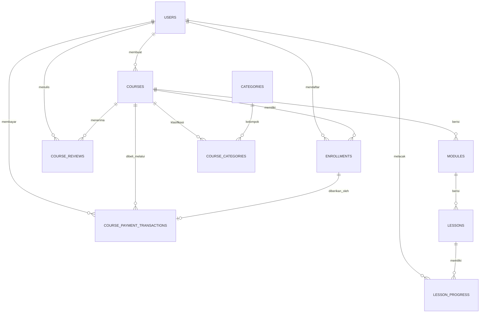

# BAB III DESAIN BASIS DATA

## 3.1 Diagram Entity Relationship Diagram (ERD)

Diagram ERD pada sistem platform e-learning ini disusun berdasarkan struktur basis data aktual yang terdapat pada file migration di dalam proyek. Diagram ini menggambarkan entitas utama, atribut penting, serta hubungan antarentitas yang mendukung proses autentikasi pengguna, pengelolaan kursus, proses pembelajaran, ulasan kursus, hingga transaksi pembayaran kursus premium.

Berdasarkan diagram tersebut, dapat dijelaskan bahwa entitas `users` menjadi pusat relasi untuk proses autentikasi, pendaftaran kursus, pelacakan progres pembelajaran, pemberian ulasan, dan transaksi pembayaran. Entitas `courses` berperan sebagai inti konten pembelajaran yang terhubung dengan kategori, modul, lesson, enrollment, review, dan transaksi pembayaran. Dengan demikian, rancangan ERD ini telah mewakili alur data utama yang berjalan pada sistem.

## 3.2 Normalisasi Basis Data

Normalisasi dilakukan untuk mengurangi redundansi data, mencegah anomali saat proses insert, update, dan delete, serta menjaga konsistensi data. Pada sistem ini, proses normalisasi dianalisis hingga bentuk normal ketiga (Third Normal Form/3NF).

### 3.2.1 Bentuk Normal Pertama (1NF)

Suatu tabel dikatakan memenuhi First Normal Form (1NF) apabila setiap atribut memiliki nilai atomik dan tidak terdapat kelompok data berulang dalam satu kolom.

Pada basis data proyek ini, setiap tabel telah memenuhi 1NF karena:

1. setiap kolom menyimpan satu nilai tunggal;
2. tidak ada atribut yang berisi daftar nilai dalam satu field;
3. data yang bersifat berulang telah dipisahkan ke tabel tersendiri.

Contoh penerapan 1NF pada sistem ini adalah:

- relasi kursus dan kategori tidak disimpan dalam satu kolom di tabel `courses`, tetapi dipisahkan ke tabel `course_categories`;
- progres belajar pengguna untuk setiap lesson tidak disimpan di tabel `users` atau `lessons`, melainkan dipisahkan ke tabel `lesson_progress`;
- data transaksi pembayaran tidak digabung ke tabel `enrollments`, tetapi dipisahkan ke tabel `course_payment_transactions`.

Dengan demikian, struktur data pada sistem sudah memenuhi prinsip 1NF.

### 3.2.2 Bentuk Normal Kedua (2NF)

Second Normal Form (2NF) mensyaratkan bahwa tabel telah memenuhi 1NF dan setiap atribut non-key harus bergantung sepenuhnya pada primary key, bukan hanya sebagian.

Pada rancangan basis data ini, 2NF terpenuhi karena:

1. sebagian besar tabel menggunakan primary key tunggal berupa `id`;
2. tabel relasi seperti `course_categories` menggunakan primary key gabungan (`course_id`, `category_id`) dan tidak memiliki atribut lain yang bergantung hanya pada salah satu bagian key;
3. tabel `enrollments` dan `lesson_progress` menggunakan primary key tunggal, namun tetap memiliki unique constraint untuk menjaga keunikan relasi bisnis.

Sebagai contoh:

- pada tabel `modules`, atribut seperti `title`, `description`, dan `order_index` bergantung penuh pada `id` modul;
- pada tabel `lessons`, atribut seperti `content`, `video_url`, dan `video_duration` bergantung penuh pada `id` lesson;
- pada tabel `course_categories`, tidak ada atribut non-key yang hanya bergantung pada `course_id` atau `category_id` saja.

Oleh sebab itu, rancangan ini telah memenuhi 2NF.

### 3.2.3 Bentuk Normal Ketiga (3NF)

Third Normal Form (3NF) mensyaratkan bahwa tabel telah memenuhi 2NF dan tidak terdapat ketergantungan transitif, yaitu atribut non-key tidak boleh bergantung pada atribut non-key lainnya.

Pada sistem ini, 3NF umumnya telah terpenuhi karena:

1. data pengguna disimpan terpisah dalam tabel `users`;
2. data kursus disimpan terpisah dalam tabel `courses`;
3. data modul dan lesson dipisahkan sesuai hirarki konten pembelajaran;
4. data enrollment, progres lesson, ulasan, dan transaksi pembayaran dipisahkan menurut fungsi bisnis masing-masing.

Contoh penerapan 3NF pada sistem ini adalah:

- informasi pembuat kursus tidak disimpan ulang di tabel `courses` dalam bentuk nama atau email, tetapi direferensikan melalui `created_by` ke tabel `users`;
- data kategori tidak disimpan langsung pada tabel `courses`, tetapi direlasikan melalui tabel penghubung `course_categories`;
- data pembayaran premium tidak dicampur dengan data akses belajar, karena akses disimpan pada `enrollments` sedangkan histori pembayaran disimpan pada `course_payment_transactions`.

Namun, terdapat beberapa keputusan desain yang bersifat praktis:

- tabel `course_payment_transactions` menyimpan payload mentah dari provider pembayaran untuk kebutuhan audit dan debugging;
- tabel `settings` menggunakan pola key-value agar konfigurasi lebih fleksibel;
- atribut `role` masih disimpan langsung pada tabel `users`, sehingga untuk skala RBAC yang lebih kompleks nantinya dapat dipisahkan lagi ke tabel role dan permission.

Secara keseluruhan, basis data pada proyek ini sudah berada pada tingkat normalisasi yang baik dan layak digunakan untuk mendukung kebutuhan aplikasi e-learning.

## 3.3 Struktur Tabel

Struktur tabel berikut disusun berdasarkan migration aktif pada proyek.

### 3.3.1 Tabel `users`

Fungsi tabel ini adalah menyimpan data akun pengguna yang digunakan untuk login, identitas profil, dan hak akses sistem.

| No  | Nama Field      | Tipe Data    | Keterangan                                    |
| --- | --------------- | ------------ | --------------------------------------------- |
| 1   | id              | INT          | Primary key, auto increment                   |
| 2   | username        | VARCHAR(50)  | Username unik pengguna                        |
| 3   | email           | VARCHAR(100) | Email unik pengguna                           |
| 4   | password        | VARCHAR(255) | Password yang sudah di-hash                   |
| 5   | full_name       | VARCHAR(100) | Nama lengkap pengguna                         |
| 6   | role            | VARCHAR(20)  | Peran pengguna: user, admin, atau super_admin |
| 7   | profile_picture | VARCHAR(255) | Path atau URL foto profil                     |
| 8   | bio             | TEXT         | Deskripsi singkat pengguna                    |
| 9   | last_login      | DATETIME     | Waktu login terakhir                          |
| 10  | created_at      | DATETIME     | Waktu pembuatan data                          |
| 11  | updated_at      | DATETIME     | Waktu pembaruan data                          |

### 3.3.2 Tabel `categories`

Tabel ini digunakan untuk menyimpan data kategori kursus.

| No  | Nama Field  | Tipe Data    | Keterangan                  |
| --- | ----------- | ------------ | --------------------------- |
| 1   | id          | INT          | Primary key, auto increment |
| 2   | name        | VARCHAR(100) | Nama kategori               |
| 3   | slug        | VARCHAR(100) | Slug unik kategori          |
| 4   | description | TEXT         | Deskripsi kategori          |

### 3.3.3 Tabel `courses`

Tabel `courses` menyimpan informasi utama mengenai kursus, termasuk metadata premium untuk monetisasi.

| No  | Nama Field        | Tipe Data    | Keterangan                               |
| --- | ----------------- | ------------ | ---------------------------------------- |
| 1   | id                | INT          | Primary key, auto increment              |
| 2   | title             | VARCHAR(255) | Judul kursus                             |
| 3   | slug              | VARCHAR(255) | Slug unik kursus                         |
| 4   | description       | TEXT         | Deskripsi lengkap kursus                 |
| 5   | short_description | VARCHAR(255) | Deskripsi singkat kursus                 |
| 6   | thumbnail         | VARCHAR(255) | Gambar thumbnail kursus                  |
| 7   | status            | VARCHAR(20)  | Status kursus: draft, published, private |
| 8   | created_by        | INT          | Foreign key ke tabel users               |
| 9   | published_at      | DATETIME     | Waktu publikasi kursus                   |
| 10  | duration          | INT          | Durasi kursus                            |
| 11  | level             | VARCHAR(20)  | Level kursus                             |
| 12  | is_featured       | BOOLEAN      | Penanda kursus unggulan                  |
| 13  | is_premium        | BOOLEAN      | Penanda kursus premium                   |
| 14  | price_amount      | INT          | Harga kursus premium                     |
| 15  | price_currency    | VARCHAR(10)  | Mata uang harga                          |
| 16  | is_purchasable    | BOOLEAN      | Status dapat dibeli atau tidak           |
| 17  | created_at        | DATETIME     | Waktu pembuatan data                     |
| 18  | updated_at        | DATETIME     | Waktu pembaruan data                     |

### 3.3.4 Tabel `course_categories`

Tabel ini merupakan tabel penghubung antara kursus dan kategori.

| No  | Nama Field  | Tipe Data | Keterangan                      |
| --- | ----------- | --------- | ------------------------------- |
| 1   | course_id   | INT       | Foreign key ke tabel courses    |
| 2   | category_id | INT       | Foreign key ke tabel categories |

### 3.3.5 Tabel `modules`

Tabel ini menyimpan data modul yang berada di dalam suatu kursus.

| No  | Nama Field  | Tipe Data    | Keterangan                   |
| --- | ----------- | ------------ | ---------------------------- |
| 1   | id          | INT          | Primary key, auto increment  |
| 2   | course_id   | INT          | Foreign key ke tabel courses |
| 3   | title       | VARCHAR(255) | Judul modul                  |
| 4   | description | TEXT         | Deskripsi modul              |
| 5   | order_index | INT          | Urutan modul dalam kursus    |
| 6   | created_at  | DATETIME     | Waktu pembuatan data         |
| 7   | updated_at  | DATETIME     | Waktu pembaruan data         |

### 3.3.6 Tabel `lessons`

Tabel ini menyimpan materi pembelajaran yang berada di dalam modul.

| No  | Nama Field     | Tipe Data    | Keterangan                   |
| --- | -------------- | ------------ | ---------------------------- |
| 1   | id             | INT          | Primary key, auto increment  |
| 2   | module_id      | INT          | Foreign key ke tabel modules |
| 3   | title          | VARCHAR(255) | Judul lesson                 |
| 4   | description    | TEXT         | Deskripsi lesson             |
| 5   | content        | TEXT         | Konten teks lesson           |
| 6   | video_url      | VARCHAR(255) | URL video pembelajaran       |
| 7   | video_duration | INT          | Durasi video                 |
| 8   | order_index    | INT          | Urutan lesson dalam modul    |
| 9   | created_at     | DATETIME     | Waktu pembuatan data         |
| 10  | updated_at     | DATETIME     | Waktu pembaruan data         |

### 3.3.7 Tabel `enrollments`

Tabel ini digunakan untuk mencatat pengguna yang terdaftar pada suatu kursus.

| No  | Nama Field          | Tipe Data    | Keterangan                   |
| --- | ------------------- | ------------ | ---------------------------- |
| 1   | id                  | INT          | Primary key, auto increment  |
| 2   | user_id             | INT          | Foreign key ke tabel users   |
| 3   | course_id           | INT          | Foreign key ke tabel courses |
| 4   | enrolled_at         | DATETIME     | Waktu pendaftaran kursus     |
| 5   | completed_at        | DATETIME     | Waktu penyelesaian kursus    |
| 6   | progress_percentage | DECIMAL(5,2) | Persentase progres kursus    |
| 7   | is_active           | BOOLEAN      | Status aktif enrollment      |

### 3.3.8 Tabel `lesson_progress`

Tabel ini menyimpan progres pengguna untuk setiap lesson.

| No  | Nama Field          | Tipe Data    | Keterangan                   |
| --- | ------------------- | ------------ | ---------------------------- |
| 1   | id                  | INT          | Primary key, auto increment  |
| 2   | user_id             | INT          | Foreign key ke tabel users   |
| 3   | lesson_id           | INT          | Foreign key ke tabel lessons |
| 4   | status              | VARCHAR(20)  | Status progres lesson        |
| 5   | progress_percentage | DECIMAL(5,2) | Persentase progres lesson    |
| 6   | started_at          | DATETIME     | Waktu mulai belajar          |
| 7   | completed_at        | DATETIME     | Waktu selesai belajar        |

### 3.3.9 Tabel `course_reviews`

Tabel ini digunakan untuk menyimpan rating dan ulasan pengguna terhadap kursus.

| No  | Nama Field | Tipe Data | Keterangan                   |
| --- | ---------- | --------- | ---------------------------- |
| 1   | id         | INT       | Primary key, auto increment  |
| 2   | course_id  | INT       | Foreign key ke tabel courses |
| 3   | user_id    | INT       | Foreign key ke tabel users   |
| 4   | rating     | INT       | Nilai rating kursus          |
| 5   | review     | TEXT      | Isi ulasan pengguna          |
| 6   | created_at | DATETIME  | Waktu pembuatan ulasan       |
| 7   | updated_at | DATETIME  | Waktu pembaruan ulasan       |

### 3.3.10 Tabel `settings`

Tabel ini menyimpan konfigurasi umum aplikasi dengan pola key-value.

| No  | Nama Field    | Tipe Data    | Keterangan                  |
| --- | ------------- | ------------ | --------------------------- |
| 1   | id            | INT          | Primary key, auto increment |
| 2   | setting_key   | VARCHAR(100) | Kunci konfigurasi unik      |
| 3   | setting_value | TEXT         | Nilai konfigurasi           |
| 4   | setting_group | VARCHAR(100) | Kelompok konfigurasi        |
| 5   | is_public     | BOOLEAN      | Penanda konfigurasi publik  |
| 6   | updated_at    | DATETIME     | Waktu pembaruan konfigurasi |

### 3.3.11 Tabel `course_payment_transactions`

Tabel ini digunakan untuk mencatat seluruh transaksi pembayaran kursus premium.

| No  | Nama Field            | Tipe Data    | Keterangan                       |
| --- | --------------------- | ------------ | -------------------------------- |
| 1   | id                    | INT          | Primary key, auto increment      |
| 2   | user_id               | INT          | Foreign key ke tabel users       |
| 3   | course_id             | INT          | Foreign key ke tabel courses     |
| 4   | granted_enrollment_id | INT          | Foreign key ke tabel enrollments |
| 5   | reference_code        | VARCHAR(100) | Kode referensi transaksi         |
| 6   | provider              | VARCHAR(50)  | Provider pembayaran              |
| 7   | status                | VARCHAR(20)  | Status transaksi                 |
| 8   | xendit_status         | VARCHAR(50)  | Status dari provider Xendit      |
| 9   | xendit_invoice_id     | VARCHAR(100) | ID invoice Xendit                |
| 10  | xendit_external_id    | VARCHAR(100) | ID eksternal pembayaran          |
| 11  | xendit_invoice_url    | VARCHAR(500) | URL invoice Xendit               |
| 12  | success_redirect_url  | VARCHAR(500) | URL redirect saat berhasil       |
| 13  | failure_redirect_url  | VARCHAR(500) | URL redirect saat gagal          |
| 14  | amount                | INT          | Nominal pembayaran               |
| 15  | currency              | VARCHAR(10)  | Mata uang pembayaran             |
| 16  | customer_email        | VARCHAR(255) | Email pelanggan                  |
| 17  | customer_name         | VARCHAR(255) | Nama pelanggan                   |
| 18  | customer_phone        | VARCHAR(50)  | Nomor telepon pelanggan          |
| 19  | expires_at            | DATETIME     | Waktu kedaluwarsa pembayaran     |
| 20  | paid_at               | DATETIME     | Waktu pembayaran berhasil        |
| 21  | expired_at            | DATETIME     | Waktu pembayaran kedaluwarsa     |
| 22  | cancelled_at          | DATETIME     | Waktu transaksi dibatalkan       |
| 23  | granted_at            | DATETIME     | Waktu enrollment diberikan       |
| 24  | last_webhook_at       | DATETIME     | Waktu webhook terakhir diterima  |
| 25  | failure_code          | VARCHAR(100) | Kode kegagalan transaksi         |
| 26  | failure_message       | TEXT         | Pesan kegagalan transaksi        |
| 27  | metadata_payload      | TEXT         | Payload metadata transaksi       |
| 28  | request_payload       | TEXT         | Payload request ke provider      |
| 29  | response_payload      | TEXT         | Payload response dari provider   |
| 30  | last_webhook_payload  | TEXT         | Payload webhook terakhir         |
| 31  | checkout_url          | VARCHAR(500) | URL checkout pembayaran          |
| 32  | status_payload_json   | TEXT         | Payload status dalam format JSON |
| 33  | created_at            | DATETIME     | Waktu pembuatan data             |
| 34  | updated_at            | DATETIME     | Waktu pembaruan data             |

## 3.4 Kesimpulan Desain Basis Data

Berdasarkan hasil analisis, desain basis data pada platform e-learning ini telah dirancang secara terstruktur dengan memisahkan data pengguna, kursus, kategori, materi pembelajaran, enrollment, progres belajar, ulasan, serta transaksi pembayaran ke dalam tabel-tabel yang saling berelasi. Struktur ini mendukung kebutuhan fungsional aplikasi, baik untuk pembelajaran gratis maupun kursus premium. Selain itu, hasil normalisasi menunjukkan bahwa basis data telah memenuhi prinsip 1NF, 2NF, dan 3NF, sehingga cukup baik dari sisi konsistensi, efisiensi penyimpanan, dan kemudahan pengelolaan data.

## 3.5 Referensi Teori

Dalam penyusunan desain basis data ini, penulis menggunakan beberapa referensi akademik yang relevan dengan konsep Entity Relationship Diagram (ERD), normalisasi basis data, dan perancangan skema relasional. Referensi tersebut digunakan sebagai dasar teoritis agar rancangan basis data yang dibuat tidak hanya sesuai kebutuhan sistem, tetapi juga sesuai dengan kaidah akademik perancangan basis data.

### 3.5.1 Daftar Referensi

1. Chen, P.-P. S. (1976). *The Entity-Relationship Model—Toward a Unified View of Data*. ACM Transactions on Database Systems. [https://doi.org/10.1145/320434.320440](https://doi.org/10.1145/320434.320440)
  Referensi ini merupakan dasar utama dalam pembahasan model Entity-Relationship dan sangat relevan untuk menjelaskan konsep entitas, atribut, relasi, serta pembentukan ERD.
2. Elmasri, R., & Navathe, S. B. (2021). *Fundamentals of Database Systems* (7th ed.). Pearson. [https://www.pearson.com/en-us/subject-catalog/p/fundamentals-of-database-systems/P200000003546/9780137502523](https://www.pearson.com/en-us/subject-catalog/p/fundamentals-of-database-systems/P200000003546/9780137502523)
  Buku ini menjadi salah satu rujukan utama dalam pembelajaran basis data karena membahas model ER, transformasi model konseptual ke relasional, serta normalisasi basis data secara sistematis.
3. Silberschatz, A., Korth, H. F., & Sudarshan, S. (2020). *Database System Concepts* (7th ed.). McGraw-Hill. [https://www.mheducation.com/highered/product/database-system-concepts-silberschatz.html](https://www.mheducation.com/highered/product/database-system-concepts-silberschatz.html)
  Buku ini digunakan untuk mendukung teori desain basis data relasional, functional dependency, serta proses perancangan skema basis data.
4. Codd, E. F. (1971). *Further Normalization of the Data Base Relational Model*. IBM Research Report RJ909. [https://dblp.org/rec/persons/Codd71a.html](https://dblp.org/rec/persons/Codd71a.html)
  Referensi ini penting dalam pembahasan normalisasi karena menjelaskan konsep bentuk normal serta anomali data pada model relasional.
5. Beeri, C., & Bernstein, P. A. (1979). *Computational Problems Related to the Design of Normal Form Relational Schemas*. ACM Transactions on Database Systems. [https://doi.org/10.1145/320064.320066](https://doi.org/10.1145/320064.320066)
  Referensi ini mendukung teori desain skema relasional dan memberikan dasar akademik mengenai hubungan antara ketergantungan fungsional dan pembentukan skema yang ternormalisasi.
6. Fagin, R. (1977). *Multivalued Dependencies and a New Normal Form for Relational Databases*. ACM Transactions on Database Systems. [https://doi.org/10.1145/320557.320571](https://doi.org/10.1145/320557.320571)
  Referensi ini digunakan untuk memperkuat pembahasan lanjutan tentang normalisasi dan menjelaskan alasan berkembangnya bentuk normal setelah 3NF.
7. Fagin, R. (1981). *A Normal Form for Relational Databases That Is Based on Domains and Keys*. ACM Transactions on Database Systems. [https://doi.org/10.1145/319587.319592](https://doi.org/10.1145/319587.319592)
  Referensi ini memberikan penguatan teoritis mengenai key, domain, dan normal form dalam konteks basis data relasional.

### 3.5.2 Referensi yang Paling Relevan untuk Bagian Ini

Dari seluruh referensi di atas, sumber yang paling relevan untuk mendukung pembahasan pada bab ini adalah:

- Chen (1976) untuk teori dasar ERD;
- Codd (1971) untuk teori normalisasi awal;
- Beeri dan Bernstein (1979) untuk desain skema relasional ternormalisasi;
- Elmasri dan Navathe (2021) serta Silberschatz, Korth, dan Sudarshan (2020) sebagai penguatan teori dari buku teks basis data modern.

